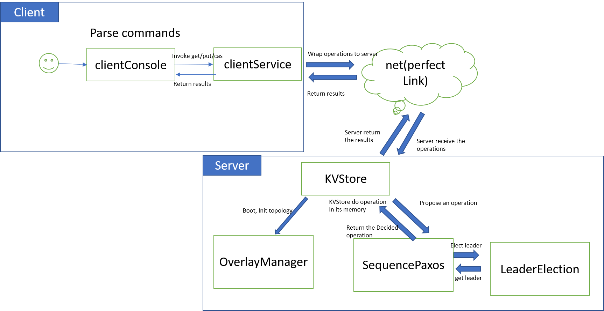

# ID2203 Project 2021 Starter Code for Kompics Scala


## Overview

Main modules:

- [x] sequence Paxos
- [x] leader election
- [x] GET/PUT/CAS kvstore
- [x] eventually perfect falure detector
- [x] overlay manager
- [x] testing

Main structure:




## Getting Started

`git clone` (your fork of) the repository to your local machine and `cd` into that folder.

Make sure you have [sbt](https://www.scala-sbt.org/) installed.

### Building

Start sbt with

```bash
sbt
```

In the sbt REPL build the project with

```bash
compile
```

You can run the test suite (which includes simulations) with

```bash
test
```

Before running the project you need to create assembly files for the server and client:

```bash
server/assembly
client/assembly
```

### Running


#### Setting up cluster using scripts

* set up cluster with server numbers 3 (default 3, or 4, 5..., but at least not less than bootThreshold in reference.conf you set)

```
./cluster_setup.sh 3
```

* in another terminal, let the client connect to the cluster

```
./client.sh
```

show the operations in client
```
> help
```

notice that currently only **one-character** key is permitted!
A simple case

```
> put c yourName
> get c
> cas c yourName hisName
```

#### Issues
if there is "port not bind" error, please manually run the command to start the cluster or client:

To run a bootstrap server node execute:
```
java -jar server/target/scala-2.12/server.jar -p 45678
```
This will start the bootstrap server on localhost:45678.

After you started a bootstrap server on <bsip>:<bsport>, again from the server directory execute:
  
```
java -jar server/target/scala-2.12/server.jar -p 45679 -s <bsip>:<bsport>
# for example
# java -jar server/target/scala-2.12/server.jar -p 45679 -s localhost:45678
```

and start the client:

```
java -jar client/target/scala-2.12/client.jar -p 56787 -b <bsip>:<bsport>
```

## Contact
Contact [sihanc@kth.se](sihanc@kth.se)
